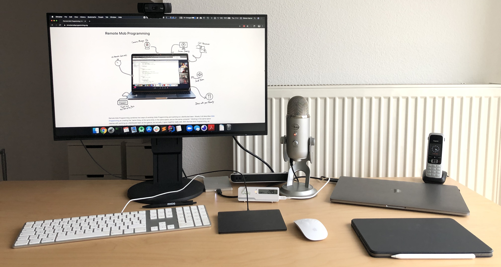
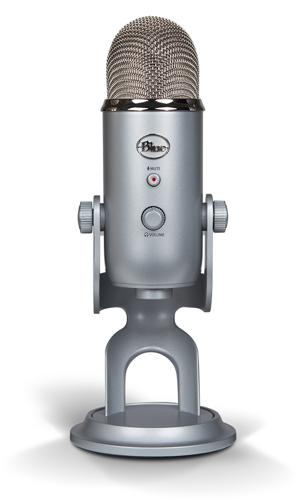

# Effective Home Office

An [opinionated](#why-opinionated) guide to effectively work from home.

In our talks and articles about working from home, [we](#authors) get frequently asked about the hardware and software we use. We want to provide our tips for a successful setup to work from home, being it tips on hardware, software, methods, or, the most important aspect, health. Happy reading!

Feel free to reach out to us on Twitter with hashtag [#effectivehomeoffice](https://twitter.com/hashtag/effectivehomeoffice) for questions, comments, praise, or critique.

## Microphone

Nobody wants to wear a headset all day.
Sadly, common integrated headset-free solutions in phones and notebooks let every listener suffer from bad audio and lots of noise.
To have happy listeners instead, get a podcaster microphone with directed antenna and noise-cancelling capabilities.
We recommend the [Blue Yeti](https://www.bluedesigns.com/products/yeti/) ($129). Set it to cardioid mode.

## Headset

Don't use a headset. If you really have to, get the [Jabra Evolve 65](https://www.jabra.com/business/office-headsets/jabra-evolve/jabra-evolve-65) ($180), or any of the [Jabra Evolve](https://www.jabra.com/business/office-headsets/jabra-evolve) family. For occasional calls, the [Apple AirPods](https://www.apple.com/airpods/) are just fine.

## Webcam

Make sure to look directly to each other in video conferences.
For that, the webcam must be on eye-level (or slightly above).
This rules out your laptop's built-in camera as it's mounted too low.
Instead, get an external webcam and mount in on top of your primary screen.
We use a [Logitech C922](https://www.logitech.com/en-us/product/c922-pro-stream-webcam) ($79).

## Computer monitor

Currently, there is no display available that we can recommend.

Our requirements:

- _27" to 30" diagonal_. Not too small and not too big. Your workspace should fit on one full-screen.
- _No ultra-wide_. Use a popular aspect ratio, so others can see your full screen when screen sharing.
- _4K resolution_. 4K is required for screen sharing, as the screen may be fitted or zoomed to your screen. 4K helps here a lot. 5K or more is not recommended, as others might have problems to display it correctly. 
- _Webcam built-in_. As stated below, the webcam should be as close to the main screen as possible. So it should be built-in and horizontally centered. 
- _Good speakers_. The voices of your communication partners should come crystal clear from the direction of the video stream. 2-Watt speakers are not crystal clear.
- _Accurate colors_. Not super important for most work. Colors should be OK.
- _Height-adjustable_. For ergonomics.
- _Thunderbolt 3 or USB-C_. State-of-the-art connectivity. We would love to finally get rid of our Thunderbolt docks.
- _Thin margins_. Design matters.

As already stated, unfortunately none of current displays match these requirements. 
We bought cheap 4K IPS displays and a Thunderbolt Dock, external Webcam, and use the MacBook speakers. 
Please give us a hint, if you have better alternatives.

We have different opinions about the usage of a second screen.
So, we won't give any recommendations here.

## Wi-Fi

Connection disruptions are annoying for everyone.
For a reliable and fast connection, use a [Cat 7 ethernet cable](https://www.amazon.com/AmazonBasics-Network-Ethernet-Patch-Cable/dp/B013PUMX8I) to connect your computer to your router.
If you have to resort to Wi-Fi, invest, for the sake of your team, in high quality access points.
We recommend Ubiquiti [Unifi](https://unifi-network.ui.com/) and [Amplifi](https://amplifi.com/).

## iPad

- iPad Pro with Apple Pencil 2

## Office Chair

Ergonomic seating and beautiful design, fully customizable: [Vitra Pacific Chair](https://www.vitra.com/en-ch/office/product/details/pacific-chair) ($900).

## Desk

Make sure that your desk is at the perfect height.
It should not jiggle when moving the mouse or bumping the leg of the table.

Jochen likes the timeless and robust [USM Haller Desk](https://www.usm.com/en/residential/products/usm-haller-collection/usm-haller-tables-and-desks/) ($1000).

## Video Conferences

Use [zoom.us](https://zoom.us/). 

Zoom is the most mature, stable, and less CPU-intense video conferencing that we know.
It hat good support for Linux and mobile devices.
We like the moveable video stream gallery view while screen sharing.

One of the few downsides: 
A meeting is always bound to a host.
There is no concept of a virtual team room, where anyone can join and go as they like.
The dependency to a single specific host user should definitly be avoided. 
As a workaround, a personal meeting room can be [configured to act like a team room](/setup-zoom-as-virtual-team-room).

When meeting with other teams or partners, we prefer to use [whereby.com](https://whereby.com/).
With Whereby, a virtual room is just a URL, such as _https://whereby.com/effectivehomeoffice_.
It runs in the browser using WebRTC, so no one has to install a client or browser plugin.
This significantly lowers the barrier to join an online meeting.

## Team Chat

- Slack
- Microsoft Teams

No: Skype, IRC, ...

## Pair Programming

- https://tuple.app/

## mob

- https://github.com/remotemobprogramming/mob

## Check-Ins

- Basecamp Check-Ins https://basecamp.com/features/checkins

## Pairing
## Mob Programming
- https://www.remotemobprogramming.org/

## Employee Readme
## Topic and Team Chat Channels
- Domain topic specific channels.
- public team channel.
- private Team-only channel.
- Fun and small talk channel.

## Ergonomics
## Desk Positioning
## Hygiene matters
## CO2 meter
## AFK Breaks
## Lunch Break

## Advanced

- Document Camera
- [Soft Light](https://www.elgato.com/en/gaming/key-light)
- [Green Screen](https://www.elgato.com/en/gaming/green-screen)

## Further Guides

[Remote: By DHH](https://basecamp.com/books/remote) is ...

[Remote Guide by Gitlab](https://about.gitlab.com/company/culture/all-remote/) is ...

[The Remote Work Playbook by Thoughtworks](https://www.thoughtworks.com/remote-work-playbook) is ...

## Things you should stop doing

## Why Opinionated

## Discuss and Contribute

Ask us anything [on Twitter with #effectivehomeoffice](https://twitter.com/hashtag/effectivehomeoffice) or [via email at hello@effectivehomeoffice.com](mailto:hello@effectivehomeoffice.com).

To contribute, create a pull request on [Github](https://github.com/effectivehomeoffice/effectivehomeoffice.com).

## Authors

[@simonharrer](https://twitter.com/simonharrer) and [@jochen_christ](https://twitter.com/jochen_christ)

<noscript></noscript>
