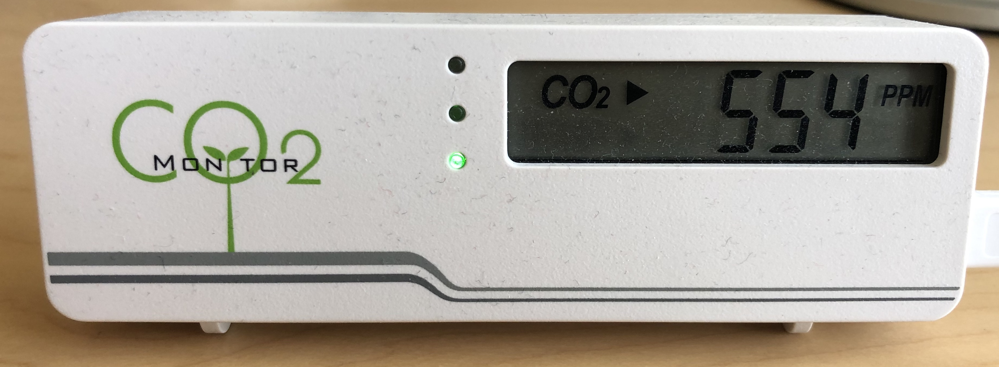
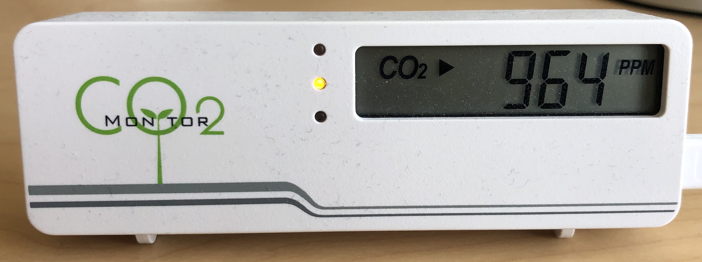
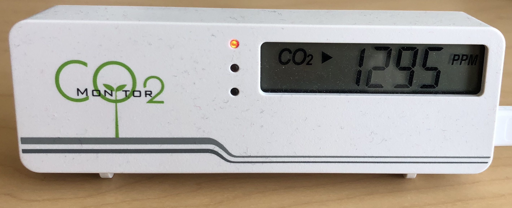

## CO2 Monitor Usage

Co2 levels have a high impact on your decision making ability.
[According to science](https://www.smithsonianmag.com/science-nature/the-carbon-dioxide-in-a-crowded-room-can-make-you-dumber-180948052/), having 1000 ppm (parts per million, the standard unit of measuring co2 levels) already decreases decision making moderately, and 2500 ppm decreases it significantly. 

You'll be suprised how quickly the co2 levels rise in a closed room, reaching numbers way above 1000 ppm. We reach 1200 ppm in our rooms within two hours.

### Start of business day

At the start of the business day, co2 levels are fine. No need to act.

### After an hour

After an hour in your home office, co2 levels will start rising. 

### After two hours

After two hours, you probably already have too high co2 levels.
Opening your windows comes too late - your decision making has already been affected.

<noscript></noscript>
