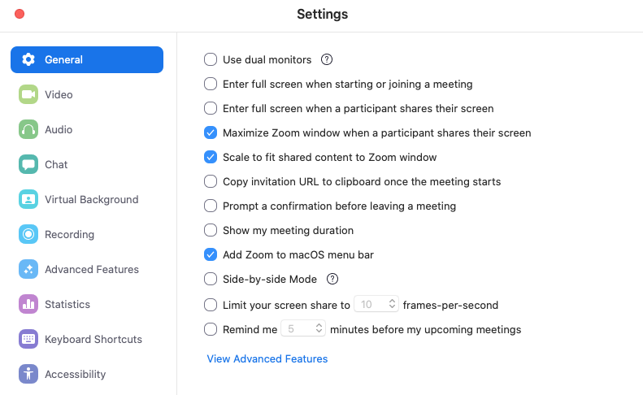

# Setup Zoom as Virtual Team Room

[Zoom](https://zoom.us/) is an awesome video conferencing solution.

However, it lacks support for a virtual team room, where everyone can join and leave at any time.
Nobody wants to wait for a host to start a conference sessions.

BTW: _Zoom Rooms_ is something entirely different. It is a solution for on-site conference rooms.

As a workaround, a _personal meeting room_ can be configured to act as a virtual team room:

- Sign up for a new zoom.us account
- Consider to upgrade to Pro ($14.99/mo) to bypass the 40 mins limit
- On the zoom.us website log in and navigate to _Meetings_ and then _Personal Meeting Room_
- _Edit this Meeting_
- Enable _Video_ for Host and Participant
- Select _Enable join before host_
- Disable _Enable waiting room_
- Save
- The meeting URL (e. g. https://zoom.us/j/2813412350) is your virtual team meeting room.

Additional recommended settings (on website):

- Settings -> In Meeting (Advanced) -> Disable _Attention tracking_ for privacy reasons
- Settings -> In Meeting (Advanced) -> Enable _Show a "Join from your browser" link_ to enable plain Browser participants
- Settings -> Email Notification -> Disable _When attendees join meeting before host_ to reduce email notifications

Additional recommended settings (in Zoom Client Preferences):

- General -> Disable _Use dual monitors_. Put both participants and shared screen and on your primary screen to have eye contact.
- General -> Enable _Maximize Zoom window when a participant shares their screen_. Focus.
- General -> Disable _Side-by-side Mode_. This increases your screen estate.
- Video -> Enable _Always display participant name on their videos_
- Video -> Enable _Display up to 49 participants per screen in Gallery View_

