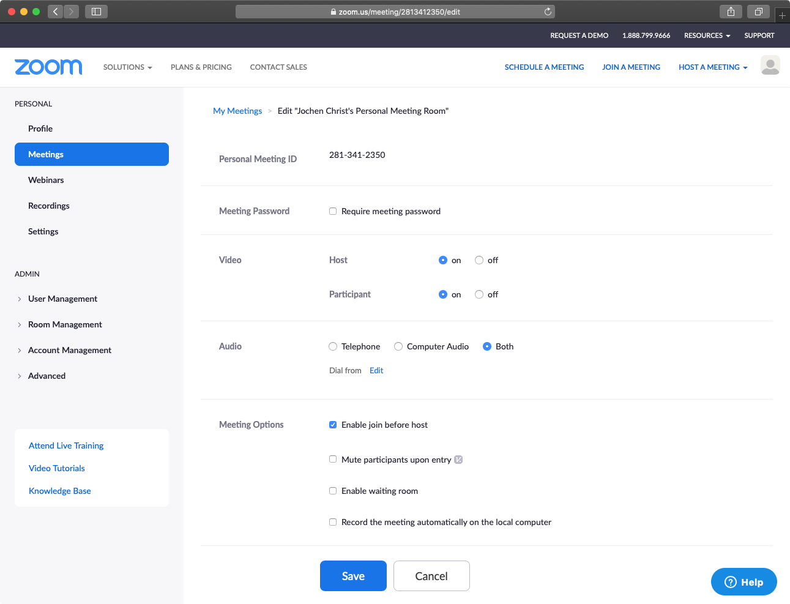

# Setup Zoom as Virtual Team Room

[Zoom](https://zoom.us/) is an awesome video conferencing solution.

However, it lacks support for a virtual team room, where everyone can join and leave at any time.
In a team, you do not want so rely on a host or admin that needs to set up and start conference sessions.

Zoom Rooms is something different (a solution fo on-site conference rooms).

As a workaround, a _personal meeting room_ can be configured to act as a virtual team room:

- Sign up for a new zoom.us account
- Consider to upgrade to Pro ($14.99/mo) to bypass the 40 mins limit
- On the zoom.us website log in
- Navigate to _Meetings_ and then _Personal Meeting Room_
- _Edit this Meeting_
- Enable _Video_ for Host and Participant
- Select _Enable join before host_
- Disable _Enable waiting room_
- Save
- The meeting URL (e. g. https://zoom.us/j/2813412350) is your virtual team meeting room.

Additional recommended settings:
- Settings -> In Meeting (Advanced) -> Disable _Attention tracking_ for privacy reasons
- Settings -> In Meeting (Advanced) -> Enable _Show a "Join from your browser" link_ to enable plain Browser participants
- Settings -> Email Notification -> Disable _When attendees join meeting before host_ to reduce email notifications

