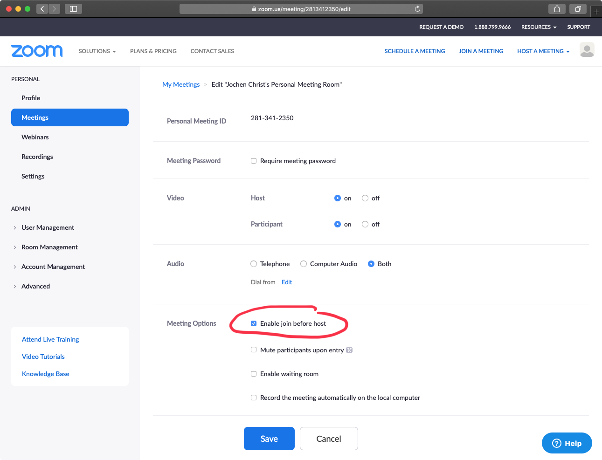

# Setup Zoom as Virtual Team Room

[Zoom](https://zoom.us/) is an awesome video conferencing solution.

However, it lacks support for a virtual team room, where everyone can join and leave at any time.
In a team, you do not want so rely on a host or admin that needs to set up and start conference sessions.

Zoom Rooms is something different (a solution fo on-site conference rooms).

As a workaround, a _personal meeting room_ can be configured to act as a virtual team room:

