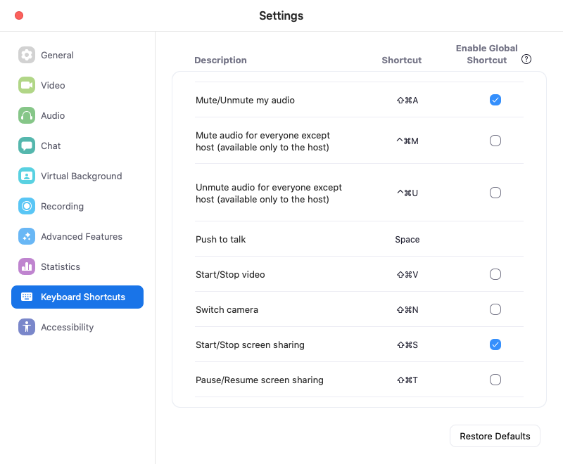
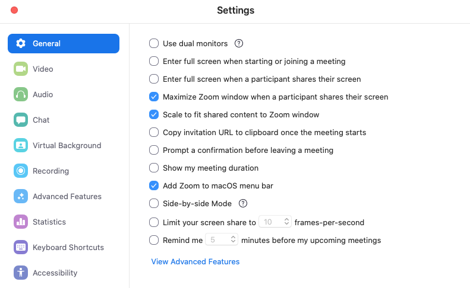

## Setup Zoom for Effective Screen Sharing

We use [zoom.us](https://zoom.us/) for all-day video conferences and screen sharing while doing [Remote Mob Programming](https://www.remotemobprogramming.org/).

### Enable Global Shortcuts

Make starting and stopping screen sharing as smooth as possible.

Enable system-wide short cuts in your desktop application.

## Focus Settings:

Also, focus the shared screen _and_ video streams:

- General -> Disable _Use dual monitors_. Put both participants and shared screen and on your primary screen to have eye contact.
- General -> Enable _Maximize Zoom window when a participant shares their screen_. Focus.
- General -> Disable _Side-by-side Mode_. This increases your screen estate.
- Video -> Enable _Always display participant name on their videos_
- Video -> Enable _Display up to 49 participants per screen in Gallery View_

