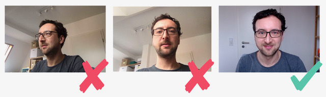

## Webcam-Position: Look to each other

Care about the position of the web cam.
The figure below shows three different settings.

On the far left you see the person only from the side; you can’t meet their eye. 
This is what happens when you work mainly on an external screen and the laptop with the camera lays besides you. 

The person in the middle looks down into the camera – a typical image when people use only their laptop with the in-built camera. 
This also implies an unintentional _perspective of power_ to look down to others.

The third person looks directly into the camera positioned right above their external monitor, allowing communication on an equal basis.

Communication on an equal basis is paramount being successful as a distributed team. 
Anyone who has ever participated in an on-site meeting by telephone knows that you only receive half of the information and practically no non-verbal information. 
One is a second class participant in such meetings. 
That’s why effective video conferences require the discipline that everybody has to dial in separately – even if some are co-located.
