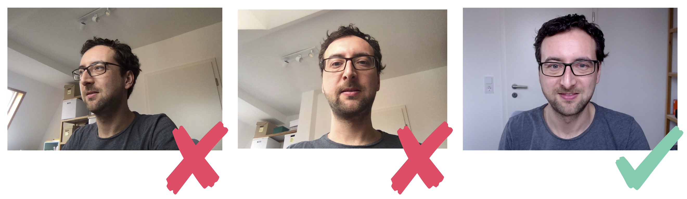

## Webcam-Position: Look to each other

Care about the position of the web cam.

The figure below shows three different settings:

### Anti-Pattern: Webcam on different monitor

On the far left you see the person only from the side; you can’t meet their eye. 
This is what happens when you work mainly on an external screen and the laptop with the camera lays besides you. 

### Anti-Pattern: Frog Perspective

The person in the middle looks down into the camera – a typical image when people use only their laptop with the in-built camera. 
This also implies an unintentional perspective of power to _look down_ to others.
And the frog-perspective presents a long neck, which is not very good-looking is most cases.

### Best-Practice: Communication on eye-level

The third person looks directly into the camera positioned right above their external monitor, allowing communication on an equal basis.
Communication on an equal basis is paramount being successful as a distributed team. 

<noscript></noscript>
